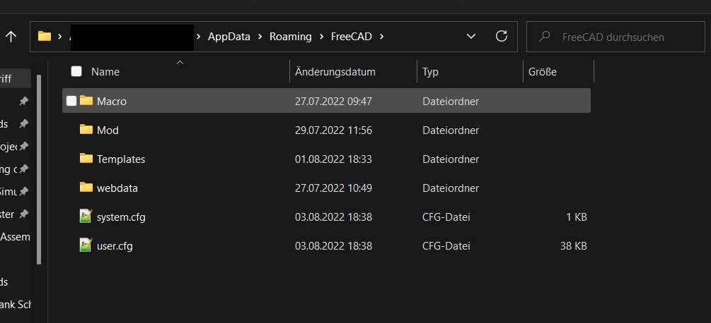
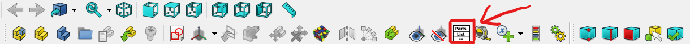

# BOM extension for "FreeCAD: Assembly 4"

The content of this repository are meant to be used with [Assembly 4](https://github.com/Zolko-123/FreeCAD_Assembly4) v0.12.3. Maybe it works with other versions (just give it a try).

## What is this repo for?
This repository contains 3 files, which replaces the files from the [Assembly 4](https://github.com/Zolko-123/FreeCAD_Assembly4) extension for [FreeCAD](https://www.freecadweb.org/?lang=us). The files from this repository contains changes which will make the work of a woodworker easier if he plans his projects with FreeCAD and Assembly 4.

These files will extend the existing BOM/Bill of material function from Assembly 4 especially for the woodworking purpose. The new BOM mechanism will create a BOM specialized for wood parts.\
The BOM now also works with parametrization and variables.\
The new mechanism also provides the creation of Cut-Lists ready for Tools like [Cutlist Optimizer](https://www.cutlistoptimizer.com/). For every different thickness of a Part a own Cut-List for this thickness is created.

There is a full [YouTube Video](https://youtu.be/HqAnKHmwbY4) out there, which describes the following steps aswell.

## How to "install" this extension?
1. Install FreeCAD and the Assembly 4 workbench
2. Download the 3 files from this repository
3. Go to your "FreeCAD" folder that contains all the installed Addons:
   
   >**Windows:**\
   > ``C:\Users\UserName\AppData\Roaming\FreeCAD``

   >**Linux:**\
   > ``/home/username/.FreeCAD``

   It should look like this:
   
4. Go to the `Templates` folder and make a backup of the file: ``Asm4_infoPartConf.json``
   > This is important if you want to remove the changes if this extansion in the future or if something goes wrong.
5. **Delete** the file ``Asm4_infoPartConf.json`` in your Templates folder
6. Go to the folder ``Mod->Assembly4`` starting from your FreeCAD folder
7. Paste the 3 files from this repository inside the Assembly4 folder and replace the existing files with the same name

## How to use the new BOM?
- First of all create your model in FreeCAD like always and if it exist, delete your old BOM created with Assembly 4.
- Then load your project for which you want to create the BOM.
- Load the Assembly 4 workbench.
- Click on the BOM button from Assembly 4:

- Then you have to select the folder in which the CSV files of the cutlists will be safed.
- That's it! 
    - You can check if the BOM, the Cut-List Spreadsheets and the CSV files were created correctly.
    - Every part should also have the standard properties like Thickness, PricePerPiece, etc. now.

If you want to refresh the BOM or the Cut-Lists just run the BOM (press the button) again.\
The most standard properties are calculated automatically are overwritten by the next time you refresh/create the BOM. The only standard properties you can change are:
 - Density (in $\frac{g}{cm^3}$)
 - PricePerPiece

## Tips for the usage of this extension
In order to work properly for the new BOM you should follow the following tips:

>**Keep everything clean:**
> - Every **Part** should contain a **Body**
> - Every **Body** should contain a **Pad** with a **Sketch** inside
> > The reason for that is that the BOM calculates the dimensions based on a virtual box arround the **Pad** of an **Body**.

>**Keep your parts flat:**
> - Every **Part** should be flat, like if you saw it out of a wide plank
> > Otherwise the dimensions and the assignment to a Cut-List get fucked up.

>**Use your pad for thickness:**
> - Always draw your Part from the top. This means your Sketch has to be the top down view of the Part in your Cut-List.
> > In other words:\
> > The length of the **Pad** of your **Sketch** has to be the thickness of the Part, otherwise the BOM doesn't assign the Part to the correct Cut-List.
> - A loosely alternative is to draw your **Sketch** on the XZ-Plane or YZ-Plane and use the Z-Axis as thickness of your Part.
